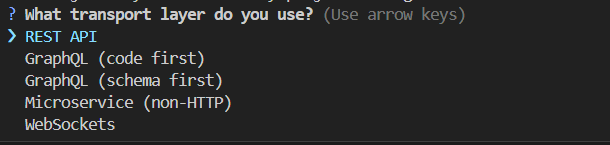
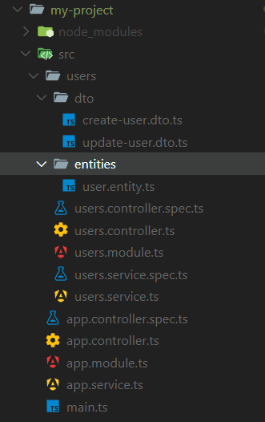
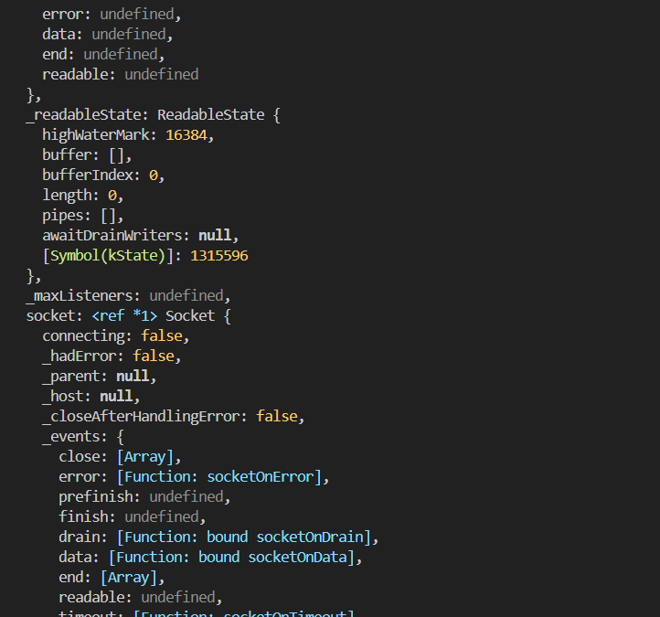
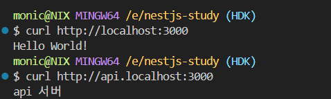
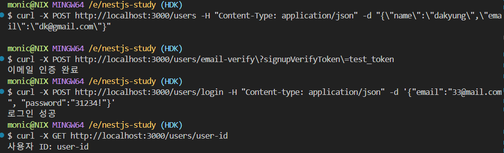

# Chapter 3. 인터페이스

## 컨트롤러

> 들어오는 요청을 받고 처리된 결과를 응답으로 돌려주는 인터페이스 역할

엔드포인트 라우팅 메커니즘을 통해 각 컨트롤러가 받을 수 있는 요청을 분류한다.

```
Q: 각 컨트롤러 하나가 엔드포인트 하나를 담당하나?

A: NO. 하나의 컨트롤러는 일반적으로 여러 엔드포인트를 담당한다. NestJS 에서 컨트롤러는 관련된 기능이나 리소스를 그룹화하여 여러 엔드포인트를 포함하는 클래스

Ex: userController-사용자 생성, 조회, 수정, 삭제 등을 관리.

컨트롤러 내의 각 메서드는 특정 HTTP 메서트와 경로에 매핑되어 개별 엔드포인트를 처리한다.
```

<br>

만들고자 하는 리소스의 CRUD 보일러플레이트 코드 일괄 생성

```
nest g resouce [name]
```

5개 선택지가 나온다.

<figure style="text-align: center;">
  
  <figcaption style="font-size: 12px; color: #ababab">보일러플레이트</figcaption>
</figure>

- REST API: HTTP 기반의 전통적 EESTful API 구현
- GraphQL(code first): Typescript 클래스와 데코레이터로 스키마 정의(코드 작성 시 자동으로 GraphQL 스키마 생성)
- GraphQL(schema first): SDL로 스키마 먼저 정의, 정의된 스키마에 맞춰 리졸버 구현
- Microservice(non-HTTP): HTTP 외 다른 전송 프로토콜 사용(TCP, Redis, MQTT 등), 마이크로서비스 아키텍처에 적합
- WebSockets: 양방향 실시간 통신 구현

<br>

오류 발생

```
Error: A merge conflicted on path "/src/users/users.controller.ts".

Failed to execute command: node @nestjs/schematics:resource --name=users --no-dry-run --no-skip-import --language="ts" --source-root="src" --spec --no-flat --spec-file-suffix="spec"
```

이 오류는 이미 프로젝트에 같은 이름의 파일이 존재할 때 발생한다. `nest g controller Users`로 유저 컨트롤러를 이미 생성한 상태에서 보일러플레이트 추가를 시도하여 발생한 문제로 추측

- 전체 삭제 후, 다시 시도해보았다.
- `nest g controller Users`로 생성한 것과 달리, uses 폴더 하위에 `dto`, `entities`폴더 외 콘트롤러, 모듈, 서비스 파일 등 여러 개의 파일들이 일괄 생성됨
<figure style="text-align: center;">
  
  <figcaption style="font-size: 12px; color: #ababab">폴더 구조</figcaption>
</figure>

### 라우팅

`app.controller.ts`

```
import { Controller, Get } from '@nestjs/common';
import { AppService } from './app.service';

@Controller()
export class AppController {
  constructor(private readonly appService: AppService) {}

  @Get()
  getHello(): string {
    return this.appService.getHello();
  }
}

```

`@Controller` 데커레이터를 클래스에 선언하는 것으로 해당 클래스는 컨트롤러의 역할을 하게 된다.

`@Get` 데커레이토를 통해, `/` 경로로 들어오는 요청을 처리할 수 있다. 라우팅 경로는 `@Get` 데커레이터의 인수로 관리할 수 있다.

```
@Get('/hello')
```

`@Controller` 데커레이터에도 인수를 전달할 수 있다.

```
@Controller('app')
```

라우팅 경로의 접두어를 지정해야 한다. (localhost:3000/app/hello)

### 와일드카드

`*` 문자를 사용하면, 문자열 가운데 어떤 문자가 와도 상관없이 라우팅 패스를 구성한다.

```
@Get('he*lo)
```

`hello`, `helo`, `he__lo` 등

- `-`, `.`은 문자열로 취급하여 사용 불가

### 요청 객체

Nest 요청과 함께 전달되는 데이터를 핸들러가 다룰 수 있는 객체로 변환하고, 이렇게 변환한 객체는 `@Req` 데커레이터로 다룰 수 있다.

```typescript
import { Controller, Get } from "@nestjs/common";
import { AppService } from "./app.service";

@Controller()
export class AppController {
  constructor(private readonly appService: AppService) {}

  @Get()
  getHello(@Req() req: Request): string {
    console.log(req);
    return this.appService.getHello();
  }
}
```

기본정보(url, method, httpVersion), 헤더 정보(headers, rawHeaders), 클라이언트 정보(socket, ip), 요청데이터(body, parmas, query, cookies), 응답 객체 참조(res) 등이 포함된다.

NestJS에서 일반적으로 요청 객체를 직접 다루진 않고, `@Query`, `@Params`, `@Body` 등 데커레이터를 사용함

<figure style="text-align: center;">
  
  <figcaption style="font-size: 12px; color: #ababab">요청객체</figcaption>
</figure>

### 응답 헤더

응답 헤더는 자동 생성되며, 커스텀 헤더를 추가하고 싶다면 `@Header` 데커레이터를 사용한다.
인수로 이름, 값을 받는다.

```
@Header('Custom', 'Test Header')
```

### 리디렉션

> 서버 요청 처리 후, 요청을 보낸 클라이언트를 다른 페이지로 이동

응답 본문에 리디렉션할 URL을 포함하여 이동을 구현할 수 있지만, `@Redirect` 데커레이터를 사용하면 훨씬 쉽게 구현이 가능하다.

```
@Redirect('https://nestjs.com', 301)
```

### 라우트 매개변수(=패스 매개변수)

1. 매개변수가 여러 개 전달될 경우

   ```typescript
   @Delete(':userId/memo/:memoId')
   deleteUserMemo(@Param() params: {[key:string]:string}){
    return `userId: ${params.userId}, memoId: ${params.memoId}`;
   }
   ```

   - `params` 타입이 any가 되어 권장하지는 않음

2. 라우팅 매개변수를 따로 받는 경우
   ```typescript
   @Delete(':userId/memo/:memoId')
   deleteUserMemo(
    @Param('userId') userId: string,
    @Param('memoId') memoId:string,){
    return `userId: ${params.userId}, memoId: ${params.memoId}`;
   }
   ```

### 하위 도메인 라우팅

다른 경로에서 들어오는 요청을 서로 다르게 처리하고 싶은 경우, 하위 도메인에서 처리하지 못하는 요청은 원래 도메인에서 처리하게 하고 싶은 경우 하위 도메인 라우팅 기법을 사용한다.

`app.controller.ts`에는 이미 루트 라우팅 경로를 가진 엔드포인트가 존재한다. `ApiController`에서도 같은 엔드포인트를 받을 수 있게 하기 위해, `ApiController`가 먼저 오도록 순서를 변경한다

```
@Module({
  imports: [UsersModule],
  controllers: [AppController, ApiController], -> [ApiController, AppController]로 변경
  providers: [AppService],
})
```

`@Controller`의 인수로 `host` 속성에 하위도메인을 기술

```
@Controller({host:'api.example.com'})
```

<figure style="text-align: center;">
  
  <figcaption style="font-size: 12px; color: #ababab">하위 도메인 라우팅</figcaption>
</figure>

`@HostParam` 데커레이터를 사용하여 서브 도메인을 변수로 받을 수 있다.->API를 버전별로 분리

### 페이로드

> 요청 시 보내는 데이터

페이로드는 데이터 통신에서 전송되는 실제 데이터 부분이다. 네트워크 통신에서 전송 프로토콜과 관련된 헤더, 메타데이터, 라우팅 정보 등을 제외한 순수한 데이터 내용을 의미한다.

HTTP 요청에서 페이로드는 주로 요청 본문(request body)에 포함된다. POST, PUT, PATCH와 같은 HTTP 메서드에서 서버로 데이터를 전송할 때 페이로드를 사용한다. GET 요청은 일반적으로 페이로드를 포함하지 않고 URL의 쿼리 파라미터를 통해 데이터를 전달한다.

NestJS에서는 `@Body()` 데코레이터를 사용하여 요청 본문의 페이로드에 접근한다. DTO(Data Transfer Object) 클래스를 사용하여 페이로드 데이터의 구조를 정의하고 검증할 수 있다.

```typescript
// 페이로드 구조 정의 (DTO)
export class CreateUserDto {
  name: string;
  email: string;
}

// 컨트롤러에서 페이로드 수신
@Post()
create(@Body() createUserDto: CreateUserDto) {
  // createUserDto 객체가 요청의 페이로드
  return `유저를 생성했습니다. 이름:${createUserDto.name}, 이메일:${createUserDto.email}`;
}
```

클라이언트에서 서버로 요청을 보낼 때 페이로드는 다음과 같이 전송된다:

```bash
curl -X POST http://localhost:3000/users -H "Content-Type: application/json" -d '{"name":"홍길동", "email":"hong@example.com"}'
```

여기서 `-d` 옵션 뒤의 JSON 데이터가 바로 페이로드다.

## 유저 인터페이스

<figure style="text-align: center;">
  
  <figcaption style="font-size: 12px; color: #ababab">결과</figcaption>
</figure>

## spec.ts

> 테스트 파일

- `*.spec.ts`: 유닛 테스트 파일
- `*.e2e-spec.ts`: E2E 테스트파일

기본 구조

```typescript
// 테스트에 필요한 모듈 임포트
import { Test, TestingModule } from "@nestjs/testing";
import { UsersController } from "./users.controller";

// 테스트 스위트 정의
describe("UsersController", () => {
  let controller: UsersController;

  // 각 테스트 전에 실행되는 설정
  beforeEach(async () => {
    const module: TestingModule = await Test.createTestingModule({
      controllers: [UsersController],
    }).compile();

    controller = module.get<UsersController>(UsersController);
  });

  // 개별 테스트 케이스
  it("should be defined", () => {
    expect(controller).toBeDefined();
  });
});
```
