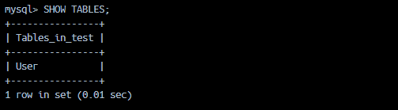

# 데이터 영속화

Nest.js는 다양한 데이터베이스와 연결할 수 있다.

- node.js 드라이버가 존재하는 데이터베이스면 사용 가능
- RDBMS, NoSQL
- MicroORM, Sequelize, Knex.js, TypeORM, Prisma 등 ORM 지원

```
ORM이란?
객체 관계 매핑
데이터베이스의 관계를 객체로 바꾸어 개발자가 OOP 로 데이터베이스를 쉽게 다룰 수 있게 하는 도구.
SQL을 코드에 기술하고, 그 결과를 쿼리셋으로 다루는 방식에서 세부 쿼리문을 추상화 하는 것으로 발전
```

## MySQL 데이터베이스 설정

도커에서 MySQL 사용

```
docker run --name mysql-local -p 3307:3306/tcp -e MYSQL_ROOT_PASSWORD=root -d mysql:8
```

- 호스트의 3307포트로 접속 시
- 컨테이너 내부의 MySQL이 리스닝 하고 있는 3306포트로 연결
- mariadb와 충돌 없이 mysql 사용

```
docker exec -it mysql-local mysql -uroot -p(password)
```

- password를 cli 에 노출하는건 위험할수도

## TypeORM으로 데이터베이스 연결

```
npm i typeorm@0.3.7 @nestjs/typeorm@9.0.0 mysql2
```

- 오류 발생
  ```
    npm ERR! code ERESOLVE
    npm ERR! ERESOLVE unable to resolve dependency tree
    npm ERR!
    npm ERR! While resolving: my-project@0.0.1
    npm ERR! Found: @nestjs/common@11.1.1
    npm ERR! node_modules/@nestjs/common
    npm ERR!   @nestjs/common@"^11.0.1" from the root project
    npm ERR!
    npm ERR! Could not resolve dependency:
    npm ERR! peer @nestjs/common@"^8.0.0 || ^9.0.0" from @nestjs/typeorm@9.0.0
    npm ERR! node_modules/@nestjs/typeorm
    npm ERR!   @nestjs/typeorm@"9.0.0" from the root project
    npm ERR!
    npm ERR! Fix the upstream dependency conflict, or retry
    npm ERR! this command with --force or --legacy-peer-deps
    npm ERR! to accept an incorrect (and potentially broken) dependency resolution.
    npm ERR!
    npm ERR!
    npm ERR! For a full report see:
  ```
- 현재 프로젝트 nest 버전과 설치하려는 typeorm 버전이 호환되지 않음
- 버전 충돌로 발생하는 의존성 충돌이므로 최신 버전으로 설치해줌

공식 문서 상 설치 명령어(버전 명시 x, 최신 버전으로)

```
npm install --save @nestjs/typeorm typeorm mysql2
```

`@nestjs/typeorm`에서 제공하는 TypeOrmModule로 DB에 연결할 수 잇따.

```typescript
import { Module } from "@nestjs/common";
import { TypeOrmModule } from "@nestjs/typeorm";
@Module({
  imports: [
    TypeOrmModule.forRoot({
      type: "mysql",
      host: "localhost",
      port: 3306,
      username: "root",
      password: "root",
      database: "test",
      entities: [],
      synchronize: true,
    }),
  ],
})
export class AppModule {}
```

1. 데이터베이스 연결 설정:

   - `type: 'mysql'`: 사용할 데이터베이스 타입을 지정
   - `host: 'localhost'`: 데이터베이스 서버의 호스트 주소
   - `port: 3306`: 데이터베이스 서버의 포트 번호 (포트 설정에 따라 3307로 수정 필요)
   - `username: 'root'`: 데이터베이스 접속 사용자 이름
   - `password: 'root'`: 데이터베이스 접속 비밀번호
   - `database: 'test'`: 사용할 데이터베이스 이름

2. 엔티티 설정:

   - `entities: []`: TypeORM이 사용할 엔티티 클래스들의 배열
   - 현재는 비어있지만, 예를 들어 `[User, Post]`와 같이 엔티티 클래스들을 추가해야 함

3. 동기화 설정:

   - `synchronize: true`: 개발 환경에서만 사용 권장 -> `true`로 설정 시, 서비스가 실행되고 데이터베이스 설정 시 데이터베이스가 초기화되므로 절대 프로덕션에서 사용해서는 안된다.
   - 엔티티 클래스의 변경사항을 자동으로 데이터베이스 스키마에 반영
   - 프로덕션 환경에서는 `false`로 설정해야 함 (데이터 손실 위험)

4. 모듈 설정:
   - `@Module({ imports: [TypeOrmModule.forRoot()] })`: NestJS의 모듈 데코레이터
   - `TypeOrmModule.forRoot()`: TypeORM을 NestJS 애플리케이션에 통합
   - `AppModule`: 애플리케이션의 루트 모듈

TypeOrmModuleOptions

```typescript
export declare type TypeOrmModuleOptions = {
  retryAttempsts?: number;
  retryDelay?: number;
  toRetry?: (err: any) => boolean;
  autoLoadEntities?: boolean;
  keepConnectionAlive?: boolean;
  verboseRetryLog?: boolean;
} & Partial<DataSourceOptions>;
```

1. 재시도 관련 옵션:

   - `retryAttempts`: number
     - 데이터베이스 연결 실패 시 재시도 횟수
     - 기본값: 10
   - `retryDelay`: number
     - 재시도 간의 대기 시간(밀리초)
     - 기본값: 3000
   - `toRetry`: (err: any) => boolean
     - 어떤 에러에 대해 재시도할지 결정하는 함수
     - 기본값: 모든 에러에 대해 재시도

2. 엔티티 관련 옵션:

   - `autoLoadEntities`: boolean
     - 모듈에 등록된 엔티티를 자동으로 로드할지 여부
     - true로 설정하면 `entities` 배열에 수동으로 추가할 필요 없음
     - 기본값: false

3. 연결 관련 옵션:

   - `keepConnectionAlive`: boolean
     - 애플리케이션이 종료된 후에도 연결을 유지할지 여부
     - 기본값: false

4. 로깅 관련 옵션:

   - `verboseRetryLog`: boolean
     - 재시도 시 상세한 로그를 출력할지 여부
     - 기본값: false

5. `Partial<DataSourceOptions>`:
   - TypeORM의 기본 데이터베이스 연결 옵션을 포함
   - type, host, port, username, password, database 등이 여기에 포함됨

예시:

```typescript
TypeOrmModule.forRoot({
  type: "mysql",
  host: "localhost",
  port: 3307,
  username: "root",
  password: "root",
  database: "test",
  autoLoadEntities: true,
  retryAttempts: 5,
  retryDelay: 1000,
  keepConnectionAlive: true,
});
```

TypeOrmModuleOptions는 두 가지 타입을 합친 것

```
//첫 번째 타입(기본 옵션)
{
retryAttempts?: number; // 재시도 횟수
retryDelay?: number; // 재시도 대기시간
autoLoadEntities?: boolean; // 엔티티 자동 로드 여부
// ... 기타 옵션들
}
```

```
//두 번째 타입(데이터베이스 연결 옵션)
{
type?: string; // 데이터베이스 종류
host?: string; // 호스트 주소
port?: number; // 포트 번호
// ... 기타 연결 옵션들
}
```

위 두 타입을 &로 합치면 두 타입의 모든 옵션을 사용하고, 선택적이므로 필요한 것만 사용 가능하다.

## 데이터베이스 연동

```
//user.entity.ts

@Entity('User')
export class UserEntity {
    @PrimaryColumn()
    id: string;
}
```

유저 엔티티를 데이터베이스에서 사용할 수 잇도록 TypeOrmModuleOptions의 entities 속성 값으로 설정, 또는 dist 디렉토리 내의 eitity.ts로 끝나는 파일명 소스코드 참조하도록 설정.

- synchroize 옵션 true이기에 서비스 구동 시, User 테이블이 생성되는 것을 확인할 수 있다.



UserModule에서 `forFeature` 메서드로 유저 모듈 내에서 사용할 저장소 등록

```
import { Module } from '@nestjs/common';
import { TypeOrmModule } from '@nestjs/typeorm';
import { EmailModule } from 'src/email/email.module';
import { UserEntity } from './entity/user.entity';
import { UsersController } from './users.controller';
import { UsersService } from './users.service';

@Module({
  imports: [
    EmailModule,
    TypeOrmModule.forFeature([UserEntity]),
  ],
  controllers: [UsersController],
  providers: [UsersService],
})
export class UsersModule { }
```

UserService에서 `@InjectRepository` 데커레이터로 유저 저장소 주입

```
  private async saveUser(name: string, email: string, password: string, signupVerifyToken: string) {
    const user = new UserEntity();
    user.id = ulid();
    user.name = name;
    user.email = email;
    user.password = password;
    user.signupVerifyToken = signupVerifyToken;
    await this.usersRepository.save(user);
  }
```

- 유저 엔티티 객체 생성
- 인수로 받은 유저 정보를 엔티티에 설정
- 저장소를 이용하여 엔티티를 데이터베이스에 저장

## 트랜잭션

> 요청을 처리하는 과정에서 데이터베이스에 변경이 일어나는 요청을 독립적으로 분리하고 에러가 발생했을 경우 이전 상태로 되돌리게 하기 위해 데이터베이스에서 제공하는 기능

- `QueryRunner`을 사용하여 단일 DB 커넥션 상태 생성하고 관리하기
- `transaction` 함수를 직접 사용하기

### QueryRunner을 사용하는 방법

- typeorm에 제공하는 DataSource 객체 주입

```typescript
  private async saveUserUsingQueryRunner(name: string, email: string, password: string, signupVerifyToken: string) {
    const queryRunner = this.dataSource.createQueryRunner();

    await queryRunner.connect();
    await queryRunner.startTransaction();

    try {
      const user = new UserEntity();
      user.id = ulid();
      user.name = name;
      user.email = email;
      user.password = password;
      user.signupVerifyToken = signupVerifyToken;

      await queryRunner.manager.save(user);

      // throw new InternalServerErrorException(); // 일부러 에러를 발생시켜 본다

      await queryRunner.commitTransaction();
    } catch (e) {
      // 에러가 발생하면 롤백
      await queryRunner.rollbackTransaction();
    } finally {
      // 직접 생성한 QueryRunner는 해제시켜 주어야 함
      await queryRunner.release();
    }
  }
```

QueryRunner 사용 단계:

1. `createQueryRunner()`: 데이터베이스 연결을 위한 QueryRunner 생성
2. `connect()`: 데이터베이스 연결
3. `startTransaction()`: 트랜잭션 시작
4. `manager.save()`: 엔티티 저장
5. `commitTransaction()`: 트랜잭션 커밋
6. `rollbackTransaction()`: 에러 발생 시 롤백
7. `release()`: QueryRunner 해제

장점:

- 트랜잭션 직접 제어 가능
- 여러 데이터베이스 작업을 하나의 트랜잭션으로 묶을 수 있음
- 에러 발생 시 롤백으로 데이터 일관성 유지

주의사항:

- QueryRunner는 반드시 `release()`로 해제해야 함
- 트랜잭션은 `commit()` 또는 `rollback()`으로 종료해야 함

### transaction 함수를 사용하는 방법

> transaction 메서드는 주어진 함수 실행을 트랜잭션으로 래핑한다. 모든 데이터베이스 연산은 제공된 엔티티 매니저를 이용하여 실행한다.

- EntityManager 를 콜백으로 받아 사용자가 어떤 작업을 수행할 함수를 작성할 수 있게 함

```
  private async saveUserUsingTransaction(name: string, email: string, password: string, signupVerifyToken: string) {
    await this.dataSource.transaction(async manager => {
      const user = new UserEntity();
      user.id = ulid();
      user.name = name;
      user.email = email;
      user.password = password;
      user.signupVerifyToken = signupVerifyToken;

      await manager.save(user);

      // throw new InternalServerErrorException();
    })
  }

```

transaction 함수 사용 단계:

1. `dataSource.transaction()`: 트랜잭션 시작
2. 콜백 함수에서 `manager`를 통해 데이터베이스 작업 수행
3. 에러 발생 시 자동으로 롤백
4. 성공 시 자동으로 커밋

장점:

- QueryRunner보다 간단한 사용법
- 트랜잭션 관리가 자동화됨
- 코드가 더 깔끔하고 가독성이 좋음
- 에러 처리와 롤백이 자동으로 처리됨

주의사항:

- 트랜잭션 내에서 발생한 에러는 자동으로 롤백됨
- 트랜잭션 내에서 다른 트랜잭션을 시작할 수 없음
- 트랜잭션 내에서 비동기 작업은 모두 `async/await`로 처리해야 함

## 마이그레이션

> 데이터베이스의 경우: 스키마를 변경하고나, 새로운 테이블을 생성하ㄱ고 또는 테이블 필드의 이름이나 속성을 변경하는 경우도 발생 -> 이를 처리하는걸 마이그레이션이라고 함

- typeorm은 마이그레이션을 쉽고 안전하게 하는 방법을 제공함
  - 마이그레이션을 위한 sql문을 직접 작성하지 않아도 됨.
  - 마이그레이션이 잘못 적용되었다면 마지막 적용한 마이그레이션 사항을 되돌리는 작업도 간단히 명령어로 수행
  - typeorm 마이그레이션 사용 시, 데이터베이스의 변경점을 소스 코드로 관리할 수 잇음-> 코드 리뷰 가능
  - 마이그레이션 이력 관리 가능

typeorm 마이그레이션을 위해서는 migration CLI 명령어를 사용, 패키지 필요

- ts-node

```
npn i -g ts-node
```

```
<!-- package.json -->

"typeorm": "ts-node -r tsconfig-paths/register ./node_modules/typeorm/cli.js"
```

typeorm 0.3에서 마이그레이션 기능으 사용하려면 DataSource 객체를 typeorm cli에 전달해야 함-> ormconfig.ts 파일 생성

TypeOrmModuleOptions에 마이그레이션 옵션 추가

```typescript
      entities: ['/src/**/*.entity{.ts,.js}'],
      synchronize: process.env.DATABASE_SYNCHRONIZE === 'false',
      migrations: ['/src/**/migrations/*.js'],
      migrationsTableName: 'migrations',
```

- 서버가 새로 구동될 때마다 테이블이 자동 생성되지 않도록 syncrhonize: false 설정
- 서버 재구동

```
npm run typeorm migration:create src/migrations/CreateUserTable
```

```
import { MigrationInterface, QueryRunner } from "typeorm";

export class CreateUserTable1747249639304 implements MigrationInterface {

    public async up(queryRunner: QueryRunner): Promise<void> {
    }

    public async down(queryRunner: QueryRunner): Promise<void> {
    }

}

```

- 파일이 생성된다. 짱신기
- 명령어로 설정한 일므과 파일 생성 시각을 조합하여 파일명 생성
- up 함수는 migration:run으로 마이그레이션이 실행되는 코드 작성
- down 함수는 migration:revert 명령으로 마이그레이션을 되돌릴 때 실행되는 코드 작성

```
npm run typeorm migration:generate src/migrations/CreateUserTable -- -d ./ormconfig.ts
```

## 저장소 패턴

> 데이터베이스와 같은 저장소를 다루는 로직을 데이터 레이어로 분리하여 핵심 비즈니스 로직에 집중할 수 있게 하는 것

저장소 패턴은 애플리케이션의 데이터 접근 계층을 추상화하는 디자인 패턴이다. 이 패턴은 데이터베이스 작업을 담당하는 코드를 비즈니스 로직과 분리하여 관리한다.

데이터 흐름은 다음과 같다. 먼저 컨트롤러가 HTTP 요청을 받으면, 이 요청은 서비스 계층으로 전달된다. 서비스 계층에서는 비즈니스 로직을 처리하고, 실제 데이터베이스 작업이 필요한 경우 저장소 계층을 호출한다. 저장소는 데이터베이스와 직접 통신하여 필요한 작업을 수행하고, 그 결과를 다시 서비스 계층으로 반환한다.

트랜잭션 처리는 서비스 계층에서 담당한다. 서비스는 여러 저장소를 조합하여 복잡한 비즈니스 로직을 처리할 수 있으며, 이 과정에서 트랜잭션을 시작하고 관리한다. 저장소는 단순히 트랜잭션 내에서 데이터베이스 작업을 수행하는 역할만 담당한다.

이러한 구조의 장점은 각 계층이 자신의 역할에만 집중할 수 있다는 점이다. 서비스 계층은 비즈니스 로직에만 집중하고, 저장소 계층은 데이터베이스 작업에만 집중할 수 있다. 또한 데이터베이스가 변경되더라도 저장소 계층만 수정하면 되므로, 전체 애플리케이션에 미치는 영향을 최소화할 수 있다.

실제 구현 시에는 각 계층의 역할을 명확히 구분하고, 저장소는 재사용 가능한 단위로 설계하는 것이 중요하다. 또한 테스트를 용이하게 하기 위해 의존성 주입을 활용하여 각 계층을 독립적으로 테스트할 수 있도록 구성한다.

# 미들웨어

> 라우트 핸들러가 클라이언트 요청을 처리하기 전에 수행되는 컴포넌트

미들웨어는 HTTP 요청이 실제 라우트 핸들러에 도달하기 전에 실행되는 중간 처리 계층이다. 마치 보안 검색대처럼, 모든 요청이 실제 목적지(라우트 핸들러)에 도달하기 전에 반드시 거쳐야 하는 검문소 역할을 한다.

미들웨어의 주요 특징:

- 어떤 형태의 코드라도 수행할 수 있다. 로깅, 인증, 데이터 변환 등 다양한 작업 가능
- 요청과 응답에 변형을 가할 수 있다. 예를 들어 요청 헤더를 수정하거나, 응답 데이터를 가공할 수 있음
- 요청/응답 주기를 끝낼 수 있다. 인증 실패 시 바로 에러 응답을 보내는 등
- 여러 개의 미들웨어를 사용한다면 `next()`로 호출 스택 상 다음 미들웨어에 제어권 전달

미들웨어의 동작 방식:

1. 클라이언트가 요청을 보내면
2. 첫 번째 미들웨어가 실행됨
3. `next()`를 호출하면 다음 미들웨어로 제어권이 넘어감
4. 마지막 미들웨어까지 실행된 후
5. 최종적으로 라우트 핸들러가 실행됨

실제 사용 예시:

- 로깅: 모든 요청의 시간과 경로를 기록
- 인증: 사용자 인증 상태 확인
- CORS: 크로스 도메인 요청 처리
- 요청 데이터 파싱: JSON 데이터를 객체로 변환
- 에러 처리: 발생한 에러를 적절한 형식으로 변환

미들웨어는 요청 처리 파이프라인을 구성하는 중요한 요소로, 애플리케이션의 보안, 로깅, 데이터 처리 등 다양한 기능을 모듈화하여 관리할 수 있게 해준다.

## 미들웨어 적용

미들오ㅔ으를 모듈에 포함시키기 위해서는 NestModule 인터페이스를 구현해야 한다.

## NestModule 인터페이스

NestModule은 NestJS에서 모듈의 구조를 정의하는 인터페이스다. 이 인터페이스는 `configure()` 메서드를 정의하는데, 이 메서드를 통해 미들웨어를 모듈에 적용할 수 있다.

`configure()` 메서드는 `MiddlewareConsumer` 타입의 매개변수를 받는다. `MiddlewareConsumer`는 미들웨어를 적용할 라우트를 지정하는 데 사용되는 객체다. 이 객체의 `apply()` 메서드로 적용할 미들웨어를 지정하고, `forRoutes()` 메서드로 미들웨어를 적용할 라우트를 지정한다.

예를 들어, `AppModule`이 `NestModule`을 구현한다면, `configure()` 메서드에서 `MiddlewareConsumer`를 사용하여 특정 라우트에 미들웨어를 적용할 수 있다. 이렇게 하면 해당 라우트에 대한 요청이 들어올 때 지정된 미들웨어가 실행된다.

NestModule 인터페이스를 구현함으로써, 모듈 레벨에서 미들웨어를 관리하고 적용할 수 있다. 이는 애플리케이션의 요청 처리 파이프라인을 구성하는 중요한 방법 중 하나다.

## 미들웨어 전역으로 적용

미들웨어를 전역으로 적용하는 것은 애플리케이션의 모든 요청에 대해 특정 미들웨어를 실행하도록 설정하는 방법이다. 이는 `main.ts` 파일에서 `app.use()` 메서드를 사용하여 구현할 수 있다.

전역 미들웨어를 적용하는 과정은 다음과 같다:

1. 미들웨어 함수 정의:

   - 미들웨어는 `Request`, `Response`, `NextFunction` 세 가지 매개변수를 받는 함수로 정의한다.
   - `NextFunction`을 호출하여 다음 미들웨어나 라우트 핸들러로 제어권을 전달한다.

2. `main.ts`에서 미들웨어 적용:
   - `app.use()` 메서드를 사용하여 미들웨어를 전역으로 적용한다.
   - 이 메서드는 미들웨어 함수를 인자로 받는다.

예를 들어, 로깅 미들웨어를 전역으로 적용하려면 다음과 같이 할 수 있다:

```typescript
// main.ts
import { NestFactory } from "@nestjs/core";
import { AppModule } from "./app.module";

async function bootstrap() {
  const app = await NestFactory.create(AppModule);

  // 전역 미들웨어 적용
  app.use((req, res, next) => {
    console.log("Request...");
    next();
  });

  await app.listen(3000);
}
bootstrap();
```

이렇게 설정하면 애플리케이션의 모든 요청에 대해 로깅 미들웨어가 실행된다. 전역 미들웨어는 모든 요청에 대해 일관된 처리를 수행할 수 있게 해주며, 로깅, 인증, CORS 처리 등에 유용하게 사용된다.

---

## NestFactory

NestFactory는 NestJS 애플리케이션의 인스턴스를 생성하는 팩토리 클래스다. 이 클래스는 `create()` 메서드를 통해 애플리케이션의 루트 모듈을 기반으로 NestJS 애플리케이션을 초기화한다.

`NestFactory.create()` 메서드는 다음과 같은 역할을 수행한다:

1. 애플리케이션 인스턴스 생성:

   - 루트 모듈을 기반으로 NestJS 애플리케이션을 초기화한다.
   - 이 과정에서 모듈의 의존성 주입, 미들웨어 설정, 라우트 설정 등이 이루어진다.

2. 애플리케이션 설정:

   - 애플리케이션의 전역 미들웨어, 파이프, 가드 등을 설정할 수 있다.
   - `app.use()` 메서드를 사용하여 전역 미들웨어를 적용할 수 있다.

3. 애플리케이션 시작:
   - `app.listen()` 메서드를 호출하여 애플리케이션을 특정 포트에서 실행한다.
   - 이 메서드는 HTTP 서버를 시작하고, 지정된 포트에서 요청을 수신한다.

`NestFactory`는 NestJS 애플리케이션의 생명주기를 관리하는 중요한 클래스로, 애플리케이션의 초기화와 실행을 담당한다. 이를 통해 모듈 기반의 구조화된 애플리케이션을 쉽게 구성하고 실행할 수 있다.

---

## NestJS 학습 시 추가로 알아두면 좋은 점

1. 데이터베이스 관련

- TypeORM의 최신 버전 사용 시 주의사항 (버전 호환성 문제)
- synchronize 옵션의 위험성 (프로덕션 환경에서는 false로 설정)
- 트랜잭션 처리 시 QueryRunner와 transaction 함수의 차이점
- 마이그레이션 관리 방법과 주의사항

2. 미들웨어 관련

- NestModule 인터페이스 구현 방법
- 미들웨어 적용 방식 (모듈별 vs 전역)
- MiddlewareConsumer를 통한 라우트별 미들웨어 설정
- 미들웨어 실행 순서와 next() 함수의 역할

3. 아키텍처 관련

- 모듈 구조와 의존성 주입
- 저장소 패턴의 실제 구현 방법
- 서비스 계층과 저장소 계층의 역할 분리
- 트랜잭션 처리 시 계층 간 책임 분리

4. 실무 적용 시

- 환경 변수 관리와 보안
- 데이터베이스 연결 설정의 환경별 관리
- 마이그레이션 이력 관리
- 에러 처리와 로깅

---

## 질문

TypeORM의 synchronize 옵션을 true로 설정하면 개발이 편해질 것 같은데, 왜 프로덕션 환경에서는 사용하면 안되지?

synchronize: true는 엔티티 클래스의 변경사항을 자동으로 데이터베이스 스키마에 반영하는 옵션이다.
개발 환경에서는 편리하지만, 프로덕션 환경에서는 다음과 같은 위험이 있다:

```
- 데이터 손실: 테이블 구조가 변경될 때 기존 데이터가 삭제될 수 있다.
- 예기치 않은 스키마 변경: 엔티티 클래스의 실수로 인한 의도치 않은 스키마 변경이 발생할 수 있다.
- 성능 이슈: 애플리케이션 시작 시마다 스키마를 검사하고 변경하는 작업이 발생한다.
  대신 마이그레이션을 사용하여 스키마 변경을 관리하는 것이 안전하다.
```

트랜잭션 처리 시 QueryRunner와 transaction 함수 중 어떤 것을 선택해야 할까.

```
두 방식의 주요 차이점은 다음과 같다:
QueryRunner:

- 트랜잭션을 직접 제어할 수 있어 더 유연하다.
- 여러 데이터베이스 작업을 하나의 트랜이션으로 묶을 수 있다.
- 수동으로 commit(), rollback(), release()를 관리해야 한다.

transaction 함수:

- 사용이 더 간단하고 코드가 깔끔하다.
- 에러 처리와 롤백이 자동으로 처리된다.
- 트랜잭션 내에서 다른 트랜잭션을 시작할 수 없다.

선택 기준:

- 단순한 트랜잭션 작업: transaction 함수 사용
- 복잡한 트랜잭션 로직이나 세밀한 제어가 필요: QueryRunner 사용
- 코드 가독성과 유지보수성 중시: transaction 함수 사용
```

NestJS에서 미들웨어를 전역으로 적용하는 것과 모듈별로 적용하는 것의 차이점은 무엇일까?

```
미들웨어 적용 방식의 차이점:

전역 적용 (app.use()):
- 애플리케이션의 모든 요청에 대해 미들웨어가 실행된다.
- main.ts에서 한 번만 설정하면 된다.
- 모든 라우트에 동일한 미들웨어가 적용된다.
- 로깅, CORS, 보안 등 공통적으로 필요한 기능에 적합하다.

모듈별 적용 (NestModule 구현):
- 특정 모듈의 특정 라우트에만 미들웨어가 적용된다.
- MiddlewareConsumer를 통해 세밀한 제어가 가능하다.
- 모듈별로 다른 미들웨어 로직을 적용할 수 있다.
- 인증, 권한 검사 등 특정 기능에 대한 미들웨어에 적합하다.

선택 기준:
- 모든 요청에 공통적으로 적용해야 하는 기능: 전역 적용
- 특정 모듈이나 라우트에만 필요한 기능: 모듈별 적용
- 보안이나 인증과 같은 중요한 기능: 모듈별 적용으로 세밀한 제어
```
