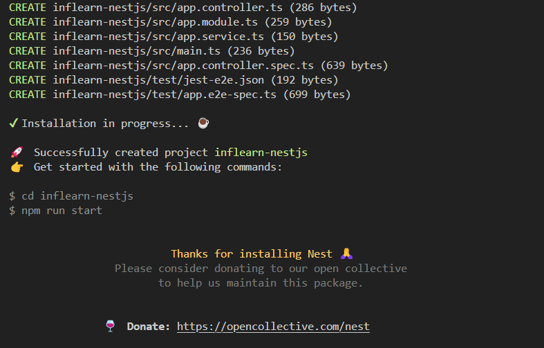

# 따라하며 배우는 NestJS 섹션1-섹션3

## Nest.js란?

> 효율적이고 확장 가능한 Node.js 서버 측 애플리케이션을 구축하기 위한 프레임워크

- Javascript + Typescript 사용 가능
- OOP, FP, FRP 요소를 사용할 수 있음

### Nest.js의 내부 구성

내부적으로는 Express와 같은 HTTP 서버 프레임워크를 사용하며, 선택적으로 Fastify를 사용하여 구성할 수 있다.

Express, Fastify 등의 Node.js 프레임워크 위에 추상화 수준을 제공하지만 API를 개발자에게 직접 노출하여, 타사 모듈을 자유로이 사용할 수 있다.

### NestJS 철학

- Node를 위한 도구, 라이브러리는 이미 많지만, 어느 것도 아키텍처의 주요 문제를 효과적으로 해결하지 못한다.

- Nest는 개발자와 팀이 고도로 테스트 가능하고 확장 가능하며 느슨하게 결합되고 유지 관리가 쉬운 애플리케이션을 만들 수 있는 즉시 사용 가능한 애플리케이션 아키텍처를 제공한다. -> `Angular`에 영감을 받음

- Express를 사용하면, 테스트, 언어, 로그 등 무수한 추가 기능들을 직접 설정해주어야 하지만, Nest는 명령어를 통해 손쉽게 사용할 수 있다.

## NestJS 시작하기

```bash
npm i -g @nestjs/cli
nest new project-name
```

새 프로젝트 디렉토리가 생성되고, 초기 핵심 Nest파일 및 지원 모듈로 디렉터리가 채워져 프로젝트의 기존 기본 구조가 생성된다.

<figure style="text-align: center;">
  
  <figcaption style="font-size: 12px; color: #ababab">콘솔이 귀엽다!!</figcaption>
</figure>

### 왜 CLI를 설치해야 하지?

- cli를 설치하면 명령어 사용이 가능하다.
  ```
  nest new [프로젝트명]    // 새 프로젝트 생성
  nest generate [항목]     // 컴포넌트 생성
  nest build              // 프로젝트 빌드
  nest start             // 서버 실행
  ```
- 자동 프로젝트 구조를 생성한다.
- 개발 도구 지원(모듈, 컨트롤러, 서비스), 테스트 파일 자동 생성, Hot Reload 지원
- 의존성 자동 설치

## NestJS 설치 및 구조

### 앱 구조

```
- App module
  - 게시글을 만드는 사람에 대한 인증 모듈(AuthModule)
    - AuthController
    - UserEntity
    - AuthService
    - UserRepository
    - JWT, PassPort
  - 게시글에 대한 모듈(BoardModule)
    - BoardController
    - BoardEntity
    - BoardService
    - BoardRepository
    - ValidationPipe
```

### 프로젝트 기본 생성 파일 살펴보기

- `eslintrc.js`: 특정한 규칙을 가지고 코드를 깔끔하게 짤 수 있게 도와주는 라이브러리(문법 오류 체크 등)
- `prettierrc`: 코드 형식을 맞추는데 사용(에러는 찾지 않고, 코드 포맷터 역할을 함)
- `nest-cli.json`: nest 프로젝트를 위해 특정한 설정을 할 수 있는 json 파일
- `tsconfig.json`: 어떻게 타입스크립트를 컴파일할지 설정하는 파일
- `tsconfig.build.json`: `tsconfig.json`의 연장선상 파일일, 빌드를 할 때 필요한 설정들을 작성하는 파일
  ```
  {
  "extends": "./tsconfig.json",
  "exclude": ["node_modules", "test", "dist", "**/*spec.ts"] //빌드할 때 필요없는 파일들 명시
  }
  ```
- `package.json`: 명령어, 의존성 등이 작성되어 있는 파일
- `src` 폴더: `main.ts`는 앱을 생성하고 실행, `app.module.ts`는 앱 모듈을 정의

### NestJS 로직 흐름

1. **시작점 (Entry Point)** `main.ts`

   - 애플리케이션의 시작점
   - `NestFactory.create(AppModule)`로 애플리케이션 인스턴스 생성
   - 지정된 포트(기본값 3000)에서 HTTP 서버 시작

2. **모듈 (Module)** `app.module.ts`

   - 애플리케이션의 루트 모듈
   - 컨트롤러와 서비스를 등록하고 관리
   - 의존성 주입(DI) 컨테이너 역할 수행

3. **컨트롤러 (Controller)** `app.controller.ts`

   - HTTP 요청 처리
   - 라우팅 설정(엔드포인트 정의)
   - 서비스 계층에 요청 위임

4. **서비스 (Service)** `app.service.ts`

   - 비즈니스 로직 처리
   - 데이터 생성 및 반환
   - 재사용 가능한 로직 캡슐화

5. **요청-응답 사이클**
   - 클라이언트 → HTTP GET 요청 → `/` 엔드포인트
   - `AppController`가 요청 수신 → `getHello()` 메서드 실행
   - `AppService`의 `getHello()` 호출 → "Hello World!" 반환
   - 클라이언트에게 응답 전송

> request -> controller -> service -> controller -> response

## NestJS 모듈

> `@Module ()` 데코레이터로 주석이 달린 클래스.

각 응용 프로그램에는 하나 이상의 모듈(루트 모듈)이 있다. 루트 모듈은 Nest의 시작점!

- 모듈은 밀접하게 관련된 기능 집합으로 구성 요소를 구성하는 효과적인 방법
- 같은 기능에 해당하는 것들은 하나의 모듈 폴더 안에 넣어서 사용함.
- 모듈은 기본적으로 싱글톤이므로 여러 모듈 간에 쉽게 공급자의 동일한 인스턴스를 공유할 수 있다.

> 싱글톤은 특정 클래스의 인스턴스가 애플리케이션 전체에서 단 하나만 생성되고 공유되는 것을 의미

<br>

**모듈의 기본 형태**

```javascript
@Module({
  imports: [관련 모듈들],
  controllers: [해당 모듈의 컨트롤러들],
  providers: [해당 모듈의 서비스들],
  exports: [다른 모듈에서 사용할 수 있게 내보낼 서비스들]
})
```

<br>

**모듈 생성**

```
nest g module boards

//using nestcli generate schematic that i want to create name of the schematic
```

boards 폴더가 생성되고, 모듈이 자동으로 추가됨. 프론트엔드 컴포넌트랑 비슷하다고 보면 되나

### NestJS 컨트롤러

> 들어오는 요청을 처리하고, 클라이언트에 응답 반환

- `@Controller` 데코레이터로 클래스를 데코레이션하여 정의한다.
- 인자를 컨트롤러에 의해 처리되는 경로로 받음 `@Controller(board)`, `@Controller(user)`

<br>

**컨트롤러 생성**

```
nest g controller boards --no-spec
```

### NestJS 핸들러

> `@Get`, `@Post`, `@Delete`와 같은 데코레이터로 장식된 컨트롤러 클래스 내의 단순 메서드

### NestJs 프로바이더

> Nest의 기본 개념. 대부분의 기본 Nest 클래스는 서비스, 리포지토리, 팩토리, 헬퍼 등 프로바이더로 취급될 수 잇다.

프로바이더의 주요 아이디어는 종송성으로 `주입`할 수 있다는 것. 객체는 서로 다양한 관계를 만들며, 객체의 인스턴스를 연결하는 기능은 대부분 Nest 런타임 시스템에 위임될 수 있다.

컨트롤러에서 필요로 하는 것들(서비스 등)을 컨트롤러 안에서 구현할 수 없다.
-> 객체들을 컨트롤러에서 사용할 수 있게 넣어주는 것=종속성 주입

```
@Module({
  controllers: [],
  providers: [] //사용하고자 하는 서비스를 넣어서 사용(ex: BoardService...)
})
```

### NestJs 서비스

> 소프트웨어 개발 내 공통 개념.

`@Injectable` 데코레이터로 감싸싸져서 모듈에 제공되며, 이 서비스 인스턴스는 서비스 전체에서 사용할 수 있다.

컨트롤러에서 데이터의 유효성을 체크하거나 데이터베이스에 아이템을 생성하는 등의 작업을 하는 부분을 처리함
-> 컨트롤에서 요청을 받아, 조금 더 복잡한 작업을 수행할 때는 서비스로 작업을 수행하고, 다시 컨트롤러를 거쳐 응답을 클라이언트로

서비스를 컨트롤러에서 사용하기 위해서는 **종속성 주입**이 필요

<br>

**서비스 생성**

```
nest g service boards --no-spec
```

### Dependency Injection

`constructor` 생성자에 서비스를 타입의 프로퍼티로 넣어서 사용. -> 인수인 파라미터가 암묵적으로 프로퍼티로 선언됨.

```
export class Boardscontroller{
  construcotr(private boardsService:BoardsService)
}
```

```
@Controller('boards')
export class BoardController {
  boardService: BoardService;

  constructor(boardsService: BoardsService){
    this.boardsService = boardsService;
  }
}
```

**this 키워드**

- `this`는 "현재 객체 자신"을 가리킴
- `this.boardsService`는 "이 컨트롤러 객체의 boardsService 변수"라는 뜻
- 생성자에서 `this.boardsService = boardsService`는 "파라미터로 받은 값을 내 클래스의 변수에 저장한다"는 의미

**왜 파라미터를 프로퍼티에 저장하는가?**

- 파라미터 `boardsService`는 생성자 함수 안에서만 사용 가능
- 클래스의 다른 메서드에서도 서비스를 사용하려면 클래스 변수(프로퍼티)에 저장해야 함
- `this.boardsService`로 저장해서 모든 메서드에서 접근 가능하게 함

**코드 흐름**

1. NestJS가 `BoardService` 객체를 생성
2. 이 객체를 `BoardController` 생성자의 파라미터로 전달
3. 생성자 안에서 `this.boardsService = boardsService`로 클래스 변수에 저장
4. 이제 컨트롤러의 모든 메서드에서 `this.boardsService`로 서비스 기능 사용 가능

<br>

# 기타

## NestJS의 싱글톤 모듈 시스템 이해

싱글톤(Singleton)이란 소프트웨어 디자인 패턴 중 하나로, 특정 클래스의 인스턴스가 애플리케이션 전체에서 **단 하나만 생성되고 공유**되는 것을 의미한다.

#### NestJS에서의 싱글톤 원칙:

1. **모듈과 프로바이더의 인스턴스화**

   - NestJS에서 모듈과 모듈 내부에 정의된 프로바이더(서비스)는 기본적으로 싱글톤으로 관리된다.
   - 애플리케이션이 시작될 때 한 번만 인스턴스화되고, 이후 필요한 곳에서 계속 재사용된다.

2. **메모리 효율성**

   - 동일한 서비스나 컴포넌트를 여러 번 생성하지 않아 메모리 사용량이 줄어든다.
   - 예를 들어 데이터베이스 연결이나 외부 API 클라이언트는 한 번만 생성되어 전체 애플리케이션에서 공유된다.

3. **상태 공유의 장점**

   - 여러 모듈에서 동일한 서비스 인스턴스를 사용하므로 상태 관리가 일관된다.
   - 예시: 사용자 인증 정보를 관리하는 `AuthService`가 여러 모듈에서 필요할 때, 동일한 인스턴스를 공유함으로써 인증 상태가 일관되게 유지된다.

4. **의존성 주입을 통한 공유**

   - 모듈 A에서 정의된 서비스를 모듈 B에서 사용하고 싶을 때, 모듈 A를 모듈 B의 `imports` 배열에 포함시키면 된다.

   ```typescript
   // 모듈 A에서 정의한 서비스
   @Injectable()
   export class SharedService {
     private count = 0;

     incrementCount() {
       this.count++;
       return this.count;
     }
   }

   // 모듈 A
   @Module({
     providers: [SharedService],
     exports: [SharedService], // 다른 모듈에서 사용할 수 있도록 내보내기
   })
   export class ModuleA {}

   // 모듈 B
   @Module({
     imports: [ModuleA], // ModuleA의 서비스를 가져와 사용
     controllers: [SomeController],
   })
   export class ModuleB {}
   ```

5. **실제 활용 사례**
   - 데이터베이스 연결 관리: 데이터베이스 연결은 비용이 많이 들기 때문에 싱글톤으로 관리하면 효율적이다.
   - 캐시 서비스: 애플리케이션 전체에서 동일한 캐시 상태를 유지해야 할 때 유용하다.
   - 설정 관리: 환경 설정 값을 모든 모듈에서 일관되게 사용할 수 있다.

싱글톤 패턴은 NestJS의 핵심 설계 원칙 중 하나로, 모듈과 서비스의 효율적인 재사용과 의존성 관리를 가능하게 하는 중요한 개념이다.
